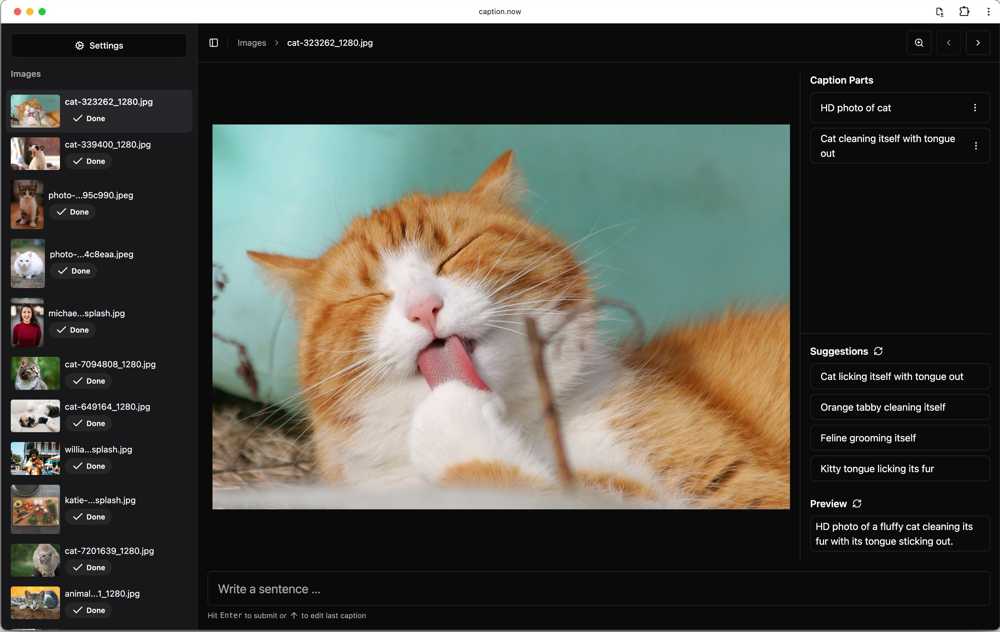

<div align="center">
  
  <p>
    <strong>Privacy-First Image Captioning, Anytime, Anywhere!</strong>
  </p>
</div>

Unlock a new level of image captioning, right from your device! **caption.now** offers a private, offline-enabled, and efficient captioning experience with **full control over your data**. No installation, no uploads, just pure, privacy-focused power. 🔐✨

## 🌟 Key Features

- **📷 In-Depth Captions, Local Processing**: Describe images with precision without ever leaving your device.
- **⚡ Streamlined Workflow**: Speed up with customizable [hotkeys](./docs/usage.md#hotkeys) and local [AI assistance](./docs/ollama.md).
- **🚫 Privacy-First, Fully Offline**: No backend server or internet dependency — your images stay on your computer, always.
- **💻 Local AI Integration**: Optional connection with [Ollama](https://ollama.com/) for enhanced AI-driven captions — all processed privately and offline on your device.

<div align="center" style="margin-top: 50px; margin-bottom: 50px">

</div>
## 🎯 Why Choose caption.now?

Designed for those who value **privacy and efficiency**, caption.now is perfect for AI training, data preparation, and more. Unlike cloud-based tools, **all data remains local** — no server uploads, ensuring **absolute data security**. Plus, with [Ollama](https://ollama.com/), you get the power of local AI support without sacrificing privacy!

Offline-first by design, caption.now lets you caption without any interruptions, even after disconnecting from the internet. Come back anytime to pick up where you left off, entirely offline.

## 🚀 Get Started in Seconds!

1. Open [caption.now](https://caption.now) — _No installation required!_
2. Start captioning immediately.

Want more control? You can [host caption.now yourself](./docs/ollama.md#error-on-captionnow-saying-something-about-browser-security-policies) or [run it locally](./docs#moderate-run-locally) for advanced use.

### 📈 AI-Assisted Captioning

Install [Ollama](https://ollama.com/) to unlock AI-assisted captions on your device! Run popular open-source models fully offline for added convenience. [Read the guide here](./docs/ollama.md).

## 📖 Usage Guide

[👉 Read the full guide](./docs/usage.md)

### 1️⃣ Getting Started

- **Open** [https://caption.now](https://caption.now) and select a directory where your images are stored.
- **Offline Assurance**: All work is local! No data leaves your device.

> _Works on Chromium-based browsers like Google Chrome, Edge, Arc, and Brave, leveraging the [File System Access API](https://developer.chrome.com/docs/capabilities/web-apis/file-system-access)._

### 2️⃣ Hotkeys: Speed Up Your Workflow

| Action                 | Hotkey                           |
| ---------------------- | -------------------------------- |
| Previous Image         | <kbd>Page Up</kbd>               |
| Next Image             | <kbd>Page Down</kbd>             |
| Submit Caption         | <kbd>Enter</kbd>                 |
| Edit Last Caption Part | <kbd>Up</kbd>                    |
| Cancel Editing         | <kbd>Escape</kbd>                |
| Apply Suggestion       | <kbd>Ctrl</kbd> + <kbd>1-5</kbd> |

### 3️⃣ Caption Parts & AI Enhancement

caption.now empowers you to build captions in segments, transforming them into seamless, coherent descriptions with AI support. Type less, get more!

#### Examples of Caption Parts:

- **HD photo of cat**
- **Sitting on a wooden table**

Using AI, these parts are magically combined, producing results like:

```
HD photograph of a cat sitting on a wooden table.
```

### 💡 Instant AI Suggestions

caption.now offers real-time suggestions to enhance your captions. For example, see **"A Siamese cat with striking blue eyes"** suggested for a more detailed description, so your final caption becomes:

```
HD photograph of a Siamese cat sitting on a wooden table. The cat has striking blue eyes.
```


### 🔄 Auto-Save Your Work

Each caption is automatically saved as a text file alongside your images, making file management easy and keeping your workflow organized.

## 🌐 Offline Access & PWA Installation

Once opened, [caption.now](https://caption.now) is accessible offline, anytime. For an app-like experience, install caption.now as a [Progressive Web App (PWA)](./docs/usage.md#installing-the-progressive-web-app).

With the PWA, you can access caption.now straight from your desktop, even when offline.
