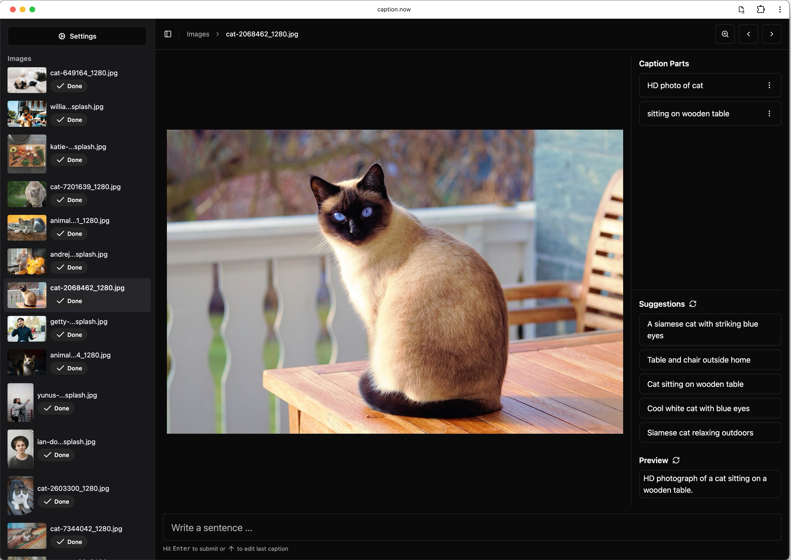
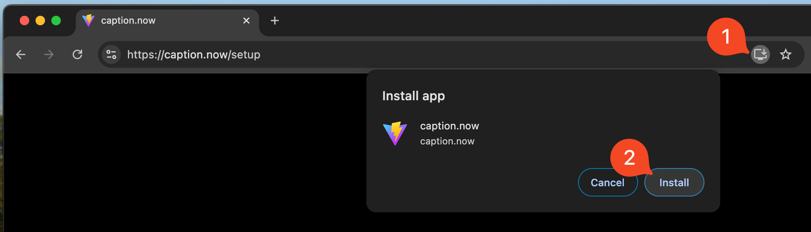

# Usage

This guide explains many features and nice-to-know aspects of using caption.now

## Getting Started

1. Open [https://caption.now](https://caption.now)
2. Select a directory

Select the directory where all the images are located and where caption.now will export it's labels to. The directory you select **will not be uploaded to a server**, everything is happening locally.

caption.now is making use of the [File System Access API](https://developer.chrome.com/docs/capabilities/web-apis/file-system-access) that is unfortunetly only supported on chromium-based browsers like Google Chrome, Edge, Arc and Brave.

## Hotkeys

<table>
  <tr>
    <th>Action</th>
    <th>Hotkey</th>
  </tr>
  <tr>
    <td>Previous image</td>
    <td><kbd>Page Up</kbd></td>
  </tr>
  <tr>
    <td>Next image</td>
    <td><kbd>Page Down</kbd></td>
  </tr>
  <tr>
    <td>Submit sentence</td>
    <td><kbd>Enter</kbd></td>
  </tr>
  <tr>
    <td>Edit last caption part</td>
    <td><kbd>Up</kbd></td>
  </tr>
  <tr>
    <td>Cancel editing</td>
    <td><kbd>Escape</kbd></td>
  </tr>
  <tr>
    <td>Apply suggestion</td>
    <td><kbd>Ctrl</kbd> + <kbd>1</kbd> (1 - 5, depending on suggestion)</td>
  </tr>
</table>

## Workflow

You can use caption.now in various ways, also highly depending on your data and AI task at hand.

### Caption Parts

Instead of writing one long caption all by yourself, caption.now establishes a workflow where you only have to type very little of the caption by yourself. That are the caption parts.

Caption parts are things that you see in the image, some examples:

- `HD photo of cat`
- `Sitting on wodden table`

### AI Captioning

Your caption parts will be post-processed by AI as you type. It will construct the best possible caption, grammatically correct and spell-checked.

Example result:

```
HD photograph of a cat sitting on a wooden table.
```



### AI Suggestions

You can also apply suggestions by the AI on the fly and add them to your suggestions.

For example, in the previous image we see the suggestions by the AI: `A siamese cat with striking blue eyes`

Oops, seems like my description could have been better, because it's not just any cat, but a siamese cat. These are details a human may miss from time to time, because we are lazy and captioning is an exhausting job.

Once we applied the suggestion:

```
HD photograph of a Siamese cat sitting on a wooden table. The cat has striking blue eyes.
```

Great caption! Even though the caption parts were not in a logical order, the AI rewrote the caption so that it's clear that we are talking about a siamese cat right from the start.

You can always dig deeper depending on your needs.


### Saving your work

There is nothing more to be done. Once you are happy with the caption, just proceed to the next image and caption.now will export a textfile named after the image in the directory you selected in the beginning.

## Working Offline

If you opened [https://caption.now](https://caption.now) at least once, you can access the app anytime, even without internet.

## Installing the Progressive Web App

If you prefer the more native feeling of an app that is installed on your computer, you may like to install caption.now as a progressive web app.



You can no also when not connected to the internet access caption.now like any app on your computer.
